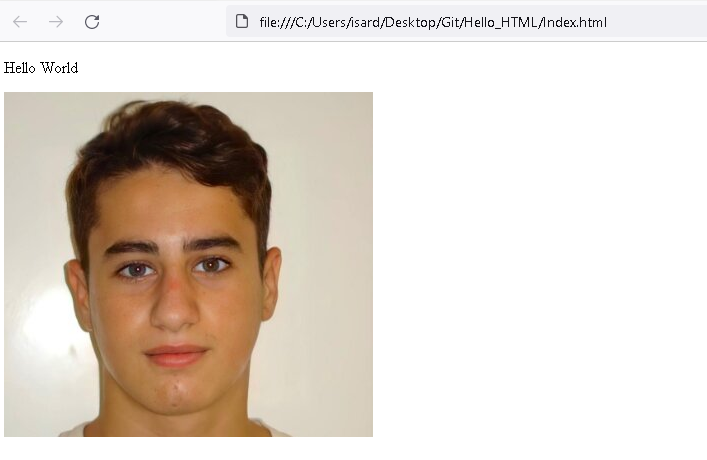

<h1> Hello_HTML 
<h1>
<h3> Esto es un proyecto de un alumno principiante.
<h3>

<h2> Instrucciones para editar el codigo:
<h2>
<h3>  1. Dirigete a https://github.com/alexpajuelo/HelloHTML 
<h3>
<h3>  2. Haz clic en "code"
<h3>
<h3>  3. En el apartado HTTPS haz clic en "Download zip"
<h3> 
<h3>  4. Una vez lo tengas descargado lo podrás editar
<h3>  
<h3>  5. Para editarlo puedes utilizar varios programas como por ejemplo Visual Studio Code.
<h3>
<h3> 6. Yo lo que he hecho ha sido poner dentro de una carpeta el archivo .html y la fotografía.
<h3>
<h3> 7. Una vez lo hayas acabado podrás probarlo haciendo clic en la parte superior, en "run" y "start with debugging".
<h3>
<h4> ¡¡ESPERO QUE TE HAYA SERVIDO!!
